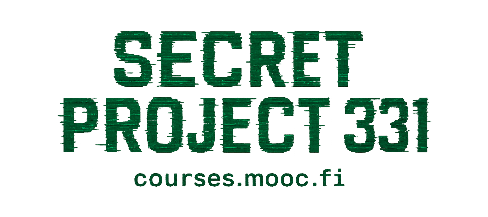
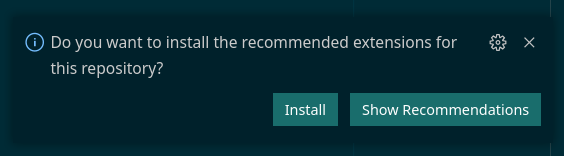

> [!IMPORTANT]
> This document contains technical information intended for software developers. If you're not a software developer, you might find these resources helpful instead:
>
> - To learn more about the courses, visit [https://www.mooc.fi](https://www.mooc.fi).
> - For teacher documentation, refer to the **Wiki** tab in this repository.

Secret Project 331 is a Learning Management System (LMS) developed by the MOOC Center of the University of Helsinki. It's deployed at [https://courses.mooc.fi](https://courses.mooc.fi). It includes:

- A visual, no-code course material editor based on blocks (text, media, embeds, exercises, etc.)
- Exercises are created directly within the material editor — no need to context-switch to a separate tool
- Multiple exercise types including multiple-choice, essay, short answer, and timelines
  - New exercise types can be added via plugins. Plugins can be developed by third parties and installed without changes to the core system
- Automatic progress tracking, pass/fail logic, and certificate generation
- Built-in glossary, citation manager, course statistics, and inline student feedback tools
- Support for multilingual courses
- Integration with the Open University of the University of Helsinki for official completion registration

> [!NOTE]
> The system builds on years of dedicated work on Massive Open Online Courses (MOOCs) at the Computer Science Department of the University of Helsinki.
> It was developed by a team led by [Henrik Nygren](https://github.com/nygrenh), who also designed the core features and software architecture.
>
> You can check out the rest of the contributors [here](https://github.com/rage/secret-project-331/graphs/contributors).

## Development Environment Setup

To begin development on Secret Project 331, set up your local environment by following the instructions in [Development.md](./docs/Development.md), which covers setup on Windows, Linux, and macOS.

## Code Style

In this project, code style is enforced with automatic tools. To ensure your contributions follow the project's code style, you need to set up pre-commit hooks and configure your editor.

### Setting Up Pre-Commit Hooks

Run `npm ci` in the repository root to install the necessary tools:

```bash
$ cd Code/secret-project-331/
$ npm ci
```

This will install `lint-staged`, which ensures that your code passes some basic code style checks before committing.

When you're ready to perform a comprehensive code style check (note: this may take some time), use:

```bash
bin/git-run-branch-ready-checks
```

### Configuring Your Editor

#### Visual Studio Code

To configure Visual Studio Code for this project, open it in the repository root with the pre-configured workspace:

```bash
$ cd Code/secret-project-331/
$ bin/code
```

The `bin/code` command automatically opens the project with recommended settings.

After opening, install the recommended extensions prompted in the bottom right corner:



Once installed, these settings will enable your editor to:

- Automatically display code style issues.
- Automatically fix some issues when saving files.

## Documentation

Documentation for teachers is located in the **Wiki** tab of this repository. The documentation within the repository itself is intended for developers only.

### Technical Documentation

- **Backend**: [Headless LMS Server Documentation](https://rage.github.io/secret-project-331/headless_lms_server/index.html)
- **Database Schema**: [Database Documentation](https://rage.github.io/secret-project-331-db-docs/)
- **Shared Module**: [Component Storybook](https://rage.github.io/secret-project-storybook/)

For additional developer documentation, see the `docs` folder in the repository.

## Development Resources

Below are essential resources, conventions, and courses to support development on this codebase. Familiarize yourself with these resources before beginning work.

### Frontend Development

- [Mobile-first CSS](./docs/mobile-first-css.md)
- Full Stack React Development: [Fullstack Open](https://fullstackopen.com/en/)
- Next.js: [Next.js Basics](https://nextjs.org/learn/basics/create-nextjs-app)
- CSS Box Model: [Mozilla CSS Box Model](https://developer.mozilla.org/en-US/docs/Learn/CSS/Building_blocks/The_box_model)
- CSS-in-JS with Emotion: [Emotion Documentation](https://emotion.sh/docs/introduction)
- CSS Layouts with Flexbox and Grid:
  - **Flexbox** (primary layout tool):
    - Patterns: [Flexbox Patterns](https://tobiasahlin.com/blog/common-flexbox-patterns/)
    - Playground: [Flexyboxes](https://the-echoplex.net/flexyboxes/)
    - Documentation: [Mozilla Flexbox Documentation](https://developer.mozilla.org/en-US/docs/Glossary/Flexbox)
  - **Grid** (secondary layout tool):
    - Documentation: [Mozilla Grid Documentation](https://developer.mozilla.org/en-US/docs/Web/CSS/CSS_Grid_Layout)
- TypeScript: [TypeScript Documentation](https://www.typescriptlang.org/docs/)
- Iframes:
  - Iframe Element: [MDN Iframe Documentation](https://developer.mozilla.org/en-US/docs/Web/HTML/Element/iframe)
  - Channel Messaging API: [Channel Messaging Documentation](https://developer.mozilla.org/en-US/docs/Web/API/Channel_Messaging_API/Using_channel_messaging)

### Deployment Resources

- Docker: [DevOps with Docker](https://devopswithdocker.com/)
- Kubernetes: [DevOps with Kubernetes](https://devopswithkubernetes.com/)

### Backend Development

- Rust Programming Language: [The Rust Book](https://doc.rust-lang.org/book/#the-rust-programming-language)
- Actix Web Framework: [Actix Web](https://actix.rs/)
- SQLx for Rust: [SQLx Usage](https://github.com/launchbadge/sqlx#usage)
- Rust by Example: [Rust by Example](https://doc.rust-lang.org/rust-by-example/)
- Learn Rust with Linked Lists: [Entirely Too Many Linked Lists](https://rust-unofficial.github.io/too-many-lists/)
- Rustlings (Rust Exercises): [Rustlings](https://github.com/rust-lang/rustlings)
- Rust Cookbook: [Rust Cookbook](https://rust-lang-nursery.github.io/rust-cookbook/)

## License

The program in the `services/cms` folder is licensed under [GPL-3.0-only](LICENSE-SERVICES-CMS).

All other parts of the codebase are licensed under [Apache-2.0](LICENSE).
