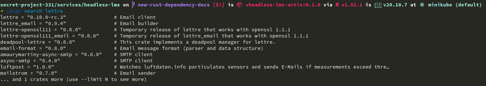
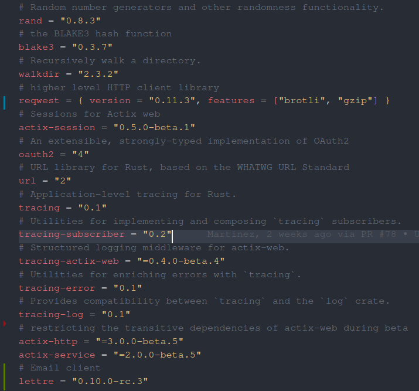

# Notes on headless lms

## Database

Interaction with the database is done with the SQLx library. Please place all your SQL queries inside the `models`-folder.

### SQLx prepare

Creating new SQL queries in headless-lms using SQLx requires running `bin/sqlx-prepare` so that it builds.

### SQLx data types

https://docs.rs/sqlx/0.5.5/sqlx/postgres/types/index.html

### New migrations

First, stop `bin/dev` if you have that running and start `bin/dev-only-db`. This is because `bin/dev` automatically runs migrations and you don't want to run your new migration before it's ready.

In the root of the repo run:

```bash
bin/sqlx-migrate-add migration_name
```

Then write your migration in `services/headless-lms/migrations/<>.up.sql` and write the reverse migration in `services/headless-lms/migrations/<>.down.sql`.

Run migrations with `bin/sqlx-migrate-run` or `bin/sqlx-migrate-revert`. Once done with the migration, test the migration by running the migration, then reverting it, and finally running it again.

### Adding new tables

Use the following as a template for new tables. It includes common fields that most tables should have, a trigger for automatically updating the updated_at field, and a comment for explaining what the table is for.

```sql
CREATE TABLE table_templates (
  id UUID DEFAULT uuid_generate_v4() PRIMARY KEY,
  created_at TIMESTAMP WITH TIME ZONE NOT NULL DEFAULT now(),
  updated_at TIMESTAMP WITH TIME ZONE NOT NULL DEFAULT now(),
  deleted_at TIMESTAMP WITH TIME ZONE
);
CREATE TRIGGER set_timestamp BEFORE
UPDATE ON table_templates FOR EACH ROW EXECUTE PROCEDURE trigger_set_timestamp();
COMMENT ON TABLE table_templates IS 'An example';
COMMENT ON COLUMN table_templates.id IS 'A unique, stable identifier for the record.';
COMMENT ON COLUMN table_templates.created_at IS 'Timestamp when the record was created.';
COMMENT ON COLUMN table_templates.updated_at IS 'Timestamp when the record was last updated. The field is updated automatically by the set_timestamp trigger.';
COMMENT ON COLUMN table_templates.deleted_at IS 'Timestamp when the record was deleted. If null, the record is not deleted.';
```

When you come up with the table name, make sure to make it plural. If you want to look at other examples, you can observe the create statements for other tables by running `bin/database-dump-schema`.

### Using postgres enums in SQLx queries

SQLx isn't able to automatically use postgres enums in its queries; it needs a type hint. For example, given the following postgres enum

```postgres
CREATE TYPE user_role AS ENUM ('admin', 'assistant', 'teacher', 'reviewer');
```

and corresponding Rust enum

```rust
#[derive(Debug, Serialize, Deserialize, PartialEq, Eq, Clone, Copy, Type)]
#[cfg_attr(feature = "ts_rs", derive(TS))]
#[sqlx(type_name = "user_role", rename_all = "snake_case")]
pub enum UserRole {
    Admin,
    Assistant,
    Teacher,
    Reviewer,
}
```

you could use `sqlx::query!` like this

```rust
let role: UserRole = sqlx::query!(r#"SELECT role AS "role: UserRole" FROM roles"#)
    .fetch_one(&mut connection) //               ^^^^^^^^^^^^^^^^^^^
    .await?
    .role;
```

The same syntax can be used with `sqlx::query_as!`

```rust
    let roles = sqlx::query_as!(
        Role,
        r#"SELECT organization_id, course_id, role AS "role: UserRole" FROM roles WHERE user_id = $1"#, user_id
        //                                         ^^^^^^^^^^^^^^^^^^^
    )
    .fetch_all(&mut connection)
    .await?;
```

Here, `Role` is a struct with various fields, including a `role: UserRole` field.

### Analyzing SQL queries

You can analyze queries to find out where most of their processing time goes. For example, given the following query:

```sql
SELECT * FROM organizations WHERE deleted_at IS NULL;
```

Add it to file `explain.sql` with the added EXPLAIN block:

```sql
EXPLAIN (ANALYZE, COSTS, VERBOSE, BUFFERS, FORMAT JSON)
SELECT * FROM organizations WHERE deleted_at IS NULL;
```

Now run the command `bin/psql-analyze explain.sql analyze.json` and then add the contents of both `explain.sql` and newly generated `analyze.json` on [https://tatiyants.com/pev/#/plans/new](https://tatiyants.com/pev/#/plans/new).

### Setup development with a local Postgres

Usually you don't need this as you can use the Postgres started by either `bin/dev` or `bin/dev-only-db`.

1. Rename `.env.example` -> `.env`
2. In `.env` setup `DATABASE_URL=postgres://localhost/headless_lms_dev`
3. `bin/local-dev-db-create-user`
4. `bin/local-dev-db-create`
5. Run `bin/sqlx-migrate-run`
6. (Optional) `bin/seed-local`
7. If migrations succeed, run `bin/dev`

## New struct/enum

When creating a new struct or enum, it's common to derive a set of often used traits to make the struct easier to work with, even if the traits aren't strictly needed right now.

```rust
use serde::{Deserialize, Serialize};

#[derive(Clone, Copy, PartialEq, Eq, Deserialize, Serialize)]
struct MyNewStruct {
    some_field: u32,
}
```

Not all of the traits can be derived for every struct. In those cases, it's fine to simply leave those out.

## Generating type bindings for frontend

Some structures and enums are also used by frontend services, primarily those that represent a request or response data. When these types are either changed or new ones added, their type bindings need to be regenerated.

The configuration for which types should be generated is located in `/services/headless-lms/server/src/ts_binding_generator.rs`. Any new type added there should derive the `ts_rs::TS` type. The ts_rs crate is behind a feature flag for [compilation performance reasons](https://github.com/rage/secret-project-331/pull/685), so you need to do the derive like this: `#[cfg_attr(feature = "ts_rs", derive(TS))]`.

To generate bindings, run the `bin/generate-bindings` binary. This will generate bindings for all services and makes sure they are properly formated.

## New endpoint

When creating a new endpoint, please bear in mind that it should follow the Separation of Concerns.

Walkthrough how to create an endpoint for LMS.

As an example, let's create an endpoint `/api/v0/bogus/foo/`, where bogus is our microservice, foo is our db model and endpoint.

This said, the endpoint should be used for the `bogus` microservice and endpoints should return `foo`s or take `foo_id` as parameter.

1. Create `foo.rs` in folder `src/models/`, if not present
2. Create `foo.rs` in folder `src/controllers/bogus/`, if not present
3. In `src/controllers/mod.rs` add the new microservice to `configure_controllers` -> `.service(web::scope("/bogus").configure(bogus::_add_routes))`, if not present.
4. Write the new `_add_routes` function in the `src/controllers/bogus/mod.rs` file and create necessary submodules. (Hint: See existing, example below).

```rust
/*!
Handlers for HTTP requests to `/api/v0/bogus`.

This documents all endpoints. Select a module below for a category.

*/

pub mod foo;

use actix_web::web::{self, ServiceConfig};

/// Add controllers from all the submodules.
pub fn add_bogus_routes(cfg: &mut ServiceConfig) {
    cfg.service(web::scope("/foo").configure(foo::_add_routes));
}


```

5. In `src/controllers/bogus/foo.rs` add the routes in e.g. `_add_routes`, so if you would like to create a CRUD for `foo`, you would add 4 routes as following:

```rust
pub fn _add_routes(cfg: &mut ServiceConfig) {
  cfg.route("", web::get().to(get_all_foos))
      .route("", web::post().to(post_new_foo))
      .route("/{foo_id}", web::put().to(update_foo))
      .route("/{foo_id}", web::delete().to(delete_foo))
}
```

The name starts with an underline in order to appear before other functions in the module documentation.

We add the routes by calling the route method instead of using the route annotations, because this method preserves the function signatures for documentation.

6. Write the CRUD route methods (get_all_foos, post_new_foo etc.) in the same file.
7. Write the logic of what the endpoint does in `src/models/foo.rs` and if needed, in other models as well if more complex endpoint.
8. If needed, create a seed at `headless-lms/db/seed.sql` and seed your database.
9. Using `headless-lms/request.rest` ensure that your endpoint works and document manually the request/response above the function in `src/controllers/bogus/foo.rs`.

### Requiring authentication

Authentication is handled by the `domain::authorization::AuthUser` extractor type. If you want an endpoint to only be accessible by authenticated users, simply add a parameter of the type `AuthUser` to that endpoint. The user's ID and other information can then be accessed through the parameter. If an unauthenticated user attempts to access the endpoint, they will receive an authorization error.

```rust
use crate::domain::authorization::AuthUser;

pub async fn private_endpoint(user: AuthUser) -> String {
    format!("Hello, {}!", user.id)
}
```

If you're making an endpoint where you want to do different things depending on whether the user is logged in or not, you can add an `Option<AuthUser>` parameter. The endpoint can still be accessed by everyone, but the argument will contain the user's details if they are authenticated.

```rust
use crate::domain::authorization::AuthUser;

pub async fn some_endpoint(user: Option<AuthUser>) -> String {
    if let Some(user) = user {
        format!("Hello, {}!", user.id)
    } else {
        "Hello, guest!".to_string()
    }
}
```

### Adding documentation to an endpoint

When you have finished coding the endpoint you should add documentations to it so they can be easily read by anyone. Documentation should include short description about the endpoint and an example response data from it.

The binary at `server/src/bin/doc-file-generator.rs` can be used to generate documentation for the response type from Rust code, ensuring they stay up to date. The binary can be called with the `bin/generate-doc-files` script, and the generated files can be used with the doc-macro crate's helper `generated_doc` macro: `#[generated_doc]` or `#[generated_doc(MyType)]`. The macro will attempt to parse the return type from the function signature if omitted from the macro call.

For example

```
/**
GET `/:course_slug/page-by-path/...` - Returns a course page by path

GET /api/v0/course-material/courses/introduction-to-everything/page-by-path//part-2/hello-world
**/
#[generated_doc]
async fn some_controller() -> ControllerResult<web::Json<MyType>> {
    todo!()
}
```

Easiest way to get the example response data and double check that endpoint works as itended is to write request to an **requests.rest** file and run the request. Before this, if needed, remember to update **seed.sql** file so that the needed data exists in a database.

After this the docs are ready to go. Docs are created automatically upon mergin your feature branch to master.

## Sqlx

Passing enum values as parameters to SQL queries: https://docs.rs/sqlx/0.5.5/sqlx/macro.query.html#type-overrides-bind-parameters-postgres-only

### Formatting inline SQL in Visual Studio Code

1. Convert the string to a raw string
2. Move the statement into its own line
3. Select the whole lines that contain the sql statement
4. Use the `SQLTools: Format Selected Query For Any Document` action from `ctrl-shift-p`-menu.

https://user-images.githubusercontent.com/1922896/119937781-0ed77b80-bf94-11eb-8e45-8d7172d86f48.mp4

### Writing unit tests that use the database

Use the `headless_lms_server::test_helper::Conn` helper struct. It can be initialized using `Conn::init`, after which the only method available for it is `Conn::begin`, which starts a transaction and returns a wrapper struct that can be used in place of `&mut PgConnection` by calling `AsMut::as_mut`. For example:

```rust
let mut conn = Conn::init().await;
let mut tx = conn.begin().await;
let orgs = all_organizations(tx.as_mut()).await.unwrap();
```

Using these helper structs helps ensure that you do not accidentally make permanent modifications to the dev database. It also helps keep tests separate from each other: modifications to the database made using a given `Conn` are only visible when making queries with the same `Conn` instance.

## Adding new dependency to cargo.toml

1. search the dependency using `cargo search <DEPENDENCY_NAME>`
   
2. Select the version of the dependency, which you need and add it manually to the **cargo.toml** file under the **[dependency]** section. Add also the comment, which was printed along side with its corresponding dependency version.
   

Then you're done! Now you can use the dependency in the project.

## Build problems with `bin/test` or `bin/dev`

### Build fails because of a missing or an out of date program in the container

This might be the case if you get something like command not found or `error: no such subcommand: xxx` from cargo.

Usually this is because the base image for the headless-lms container has been updated, but your computer has not pulled the updated image. To pull the updated image to your local Minikube, run the following command in the repo root: `bin/minikube-pull-baseimages`. After that restart the development environment.

## Logging

Use these `trace!, debug!, info!, warn!, and error!` to log, see format from https://tracing.rs/tracing/index.html#recording-fields

To log a variable with its debug formatting:

```rust
error!(?response_body, "Grading request returned an unsuccesful status code");
```

To log a variable with its display formatting:

```rust
error!(%response_body, "Grading request returned an unsuccesful status code");
```

To use a different variable name in the log message:

```rust
error!(body = ?response_body, "Grading request returned an unsuccesful status code");
```

## Async

### Want to call an async function but one of the variables you want to pass to it is an Option

In this example, we want to call the function `get_page` which takes an `Uuid` as the second argument. However, we want to pass `chapter.chapter_front_page_id` which is an `Option<Uuid>`. To get around the issue, we will call map on the `Option<Uuid>` to modify the value only when the option is not None. Then, since the get_page is an async function, and we cannot await inside the map we will return a Future from the closure and convert the result of the map to an `OptionFuture`, which allows us to await the result.

```rust
let page_option_future: OptionFuture<_> = chapter
    .chapter_front_page_id
    .map(|chapter_front_page_id| get_page(conn, chapter_front_page_id))
    .into();
let page = page_option_future.await.transpose()?; // The result is Option<Page>
```

Alternatively:

```rust
let page = OptionFuture::from(
    chapter.chapter_front_page_id.map(|chapter_front_page_id| get_page(conn, chapter_front_page_id))
).await.transpose()?; // The result is Option<Page>
```
