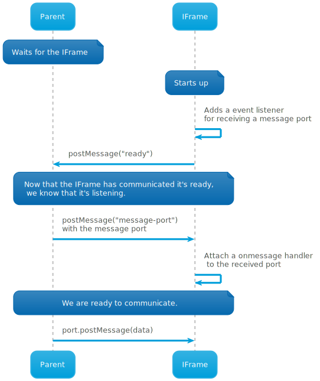

# IFrames

IFrames are used to bring specialized parts of user interfaces from exercise specific microservices to the more generic services. All communication with the IFrames is done with a MessageChannel (https://developer.mozilla.org/en-US/docs/Web/API/MessageChannel) between the parent document and the IFrame.

When the IFrame starts up, it gets the MessagePort for sending messages to the MessageChannel using the following process:



## Messages in the message channel

### height-changed

from: IFrame

to: parent

IFrame tells the parent its new height so that the parent can resize the IFrame.

Example 1:

```js
{
  message: "height-changed",
  data: 11
}
```

Example 2:

```js
{
  message: "height-changed",
  data: 25
}
```

### set-state

from: parent

to: IFrame

Parent posts the current saved state to the IFrame. Upon receiving this message, the IFrame is supposed to discard its existing internal state and start using the received state. The data can be anything -- the format is up to the exercise service.

Example 1:

```js
{
  message: "set-state",
  data: [{ name: "yes", correct: true }, { name: "no", correct: false }]
}
```

Example 2:

```js
{
  message: "set-state",
  data: { password: "dasdasd9" }
}
```

### set-language

from: parent

to: IFrame

Parent informs the iframe of the language of the user interface. The data is the new language represented as an IETF primary language subtag tag (e.g "en" for English or "fi" for Finnish) or as a full IETF language tag (e.g. "en-US" for American English or "en-GB" for British English).

Full tags should fall back to the primary language subtag if the full tag is not supported. For example if we set the language to "en-GB", the IFrame should fall back to "en" if it does not support "en-GB". If the parent sends a language tag that is not supported at all, the IFrame should fall back to some supported language (preferably "en").

The parent will also send this message also when the iframe is first loaded.

See also: https://en.wikipedia.org/wiki/IETF_language_tag

Example 1:

```js
{
  message: "set-language",
  data: "en"
}
```

Example 2:

```js
{
  message: "set-language",
  data: "en-GB"
}
```

### current-state

from: IFrame

to: parent

IFrame posts its updated state. The IFrame is supposed to post this message whenever its internal state changes. The data posted will contain one of the following things depending on the use case:

- Private spec. This can be anything that defines the exercise. This gets saved and will be passed to the exercise service when loading the editor again and when grading a submission.
- Public spec. Specification that hides the correct answer that will be used to render an exercise to the student when they start doing the exercise. This will not be passed back to the editor when loading it again because the exercise service is supposed to be able to derive this again from the private spec.

The data is also accompanied by a validity status that indicates whether it should be able to be stored in its current form.

Example 1:

```js
{
  message: "current-state",
  data: [{ name: "yes", correct: true }, { name: "no", correct: false }],
  valid: true
}
```

Example 2:

```js
{
  message: "current-state",
  data: { password: "dasdasd9" },
  valid: true
}
```
