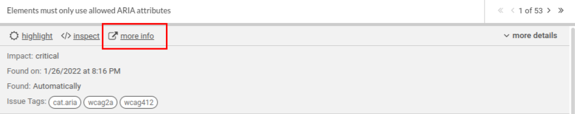

# Tests

## Skipping accessibility in tests / Guide to axeSkip

If you need to skip some accessibility rules on tests, then you should use axeSkip.

### Obtain error from browser

You can obtain the ID for the rule from browser by pressing 'more info' and then in the top left corner there is 'Rule ID'. Below there's also example of the violation in console, in console it is just "id"



axeSkip is given to the expectScreenshotsMatchSnapshots function

```js
await expectScreenshotsToMatchSnapshots({
  axeSkip: ["aria-hidden-focus"],
  page,
  headless,
  snapshotName: "search-continuous-phrases-ranked-higher-than-word-matches",
  waitForThisToBeVisibleAndStable: "text=banana cat enim",
})
```

For example if you get the following violation

```js
Violation 1
-----------
  Rule: landmark-one-main
  Description: Ensures the document has a main landmark
  Impact: moderate
  Help: Document should have one main landmark
  Help URL: https://dequeuniversity.com/rules/axe/4.3/landmark-one-main?application=playwright
  Affected DOM nodes:{
    ...
  }

```

You can skip it with this

```js

axeSkip: ["landmark-one-main"],

```
